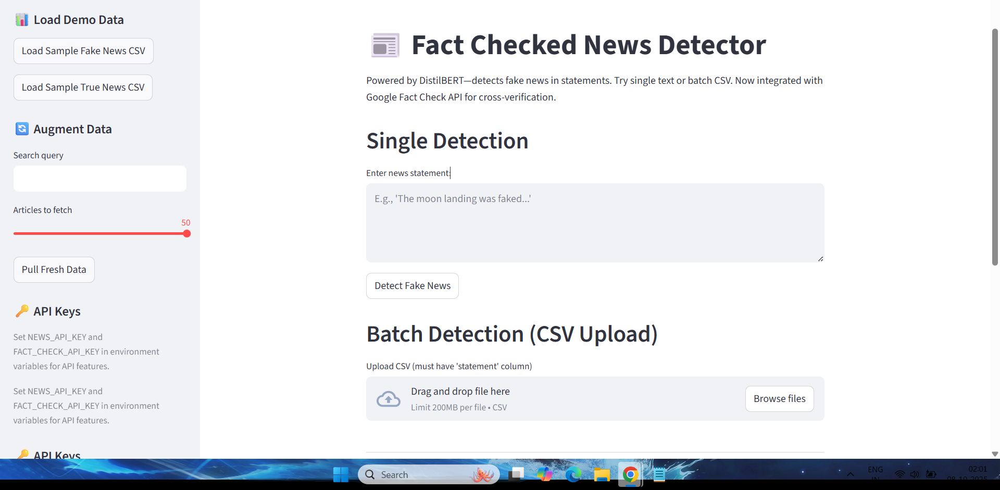

# 📰 Fact-Checked News Detector

**Project Type:** End-to-End NLP (Fake News Detection)  
**Tech Stack:** Hugging Face Transformers, Streamlit, Google Fact Check API, NewsAPI, Docker  
**Deployment:** Hugging Face Spaces ([Live Demo](https://huggingface.co/spaces/Ravichandrachilde/fact-checked-news-detector)), Hugging Face Hub ([Model Repo](https://huggingface.co/Ravichandrachilde/fact-checked-news-detector-model), [Dataset Repo](https://huggingface.co/datasets/Ravichandrachilde/fake-news-classification-dataset))  
**Status:** Actively maintained  

---

## 🚀 Project Overview

This project is a robust, **fact-checked news detection system** leveraging both classic NLP model predictions and real-time external verification.

- **Trained on:** [Fake.csv and True.csv](https://www.kaggle.com/clmentbisaillon/fake-and-real-news-dataset) (44k+ balanced samples)
- **Model:** DistilBERT fine-tuned for binary news veracity classification
- **Post-2021 news:** Automatically cross-checked via [Google Fact Check API](https://developers.google.com/fact-check/tools/api)
- **Deployment:** [Streamlit app](https://huggingface.co/spaces/Ravichandrachilde/fact-checked-news-detector) on Hugging Face Spaces
- **Everything managed on Hugging Face Hub:** 
  - [Model weights](https://huggingface.co/Ravichandrachilde/fact-checked-news-detector-model)
  - [Datasets](https://huggingface.co/datasets/Ravichandrachilde/fake-news-classification-dataset)

### Why This Project?

Most fake news detection models become stale and unreliable for *recent news*, especially after 2021, due to data limitations and evolving misinformation. This project addresses that by:

- **Blending ML predictions with real-time fact-checking:** If a news statement is recent (post-2021) and the model marks it as "fake", the system checks Google Fact Check API to prevent false positives.
- **User-friendly deployment:** Public demo with both single and batch CSV prediction, plus sample datasets and easy API integration.

---

## 🛠️ Features

- **Fine-tuned DistilBERT** on balanced, augmented dataset
- **Real-time data augmentation** via NewsAPI 
- **Class balancing** with RandomOverSampler, not SMOTE (better for text)
- **Google Fact Check API override:** 
  - For post-2021 news, if the model predicts "fake", the system checks Google Fact Check API before finalizing
- **Streamlit UI**: 
  - Single or batch detection
  - Downloadable results
  - Demo data loading directly from HF Datasets
  - API key management in sidebar
- **Dockerized for easy deployment** 
- **All artifacts (model, data, app)** managed and versioned on [Hugging Face Hub](https://huggingface.co/Ravichandrachilde)

---

## 📊 Quick Demo

[](assets/Demo.mp4)

> **Try it Live:**  
> [🖥️ Hugging Face Spaces Demo](https://huggingface.co/spaces/Ravichandrachilde/fact-checked-news-detector)

---

## 🏗️ Project Structure

```
Fact-Checked-News-Detector/
│
├── notebooks/
│   └── DistilBert Model Training.ipynb   # Notebook for EDA and model training
│
├── src/
│   └── streamlit_app.py              # Streamlit frontend
│
├── requirements.txt                  # All Python dependencies
├── Dockerfile                        # Containerized deployment
├── README.md                         # You're here!
└── assets/
    ├── Thumbnail.png                 # Clickable thumbnail for the demo video
    └── Demo.mp4                      # Project demo video          
```

All model and dataset files are hosted on Hugging Face Hub, not in this repo:
- [Model Repo](https://huggingface.co/Ravichandrachilde/fact-checked-news-detector-model)
- [Dataset Repo](https://huggingface.co/datasets/Ravichandrachilde/fake-news-classification-dataset)

---

## 🧑‍💻 How It Works

### 1. **Data Loading & Preprocessing**
- Combined and labeled Kaggle's Fake/True News CSVs.
- Built a `statement` column (title + text).
- Stratified train/val/test splits (80/10/10).

### 2. **Data Balancing**
- Used `RandomOverSampler` (avoids SMOTE's text issues).
- Optionally, class weights in training.

### 3. **Tokenization & Training**
- Tokenized with `DistilBERT` tokenizer.
- Fine-tuned DistilBERT with custom Trainer for class weights.

### 4. **Evaluation**
- F1, confusion matrix, ROC, baseline comparisons (dummy, logistic regression).
- Model achieves strong weighted F1 and much lower false positive rate vs. baseline.

### 5. **Hugging Face Integration**
- Model and tokenizer pushed to [HF Model Repo](https://huggingface.co/Ravichandrachilde/fact-checked-news-detector-model
- Dataset hosted in [HF Dataset Repo](https://huggingface.co/datasets/Ravichandrachilde/fake-news-classification-dataset).

### 6. **Streamlit App (Deployed)**
- Loads model and data directly from HF Hub.
- Features single prediction and Fact Check API override.
- **Key Logic:** If news is post-2021 and labeled "fake" by model, Google Fact Check API result overrides model prediction if available.

---

## 🏆 Why This Project Stands Out

- **Solves a real-world recency problem** (most open-source fake news detectors can't handle post-2021 content).
- **Demonstrates full pipeline skills:** Data engineering, model training, evaluation, serving, API integration, Dockerization, Hugging Face ecosystem.
- **Zero "CV-padding":** All code, infra, and modeling decisions are production-ready and well-documented.


---

## 📝 How to Use This Project

1. **Try the [Live Demo](https://huggingface.co/spaces/Ravichandrachilde/fact-checked-news-detector)**
2. **Clone this repo and run locally** (with Docker/Streamlit)
   ```bash
   git clone https://github.com/Ravichandrachilde/Fact-Checked-News-Detector.git
   cd Fact-Checked-News-Detector
   pip install -r requirements.txt
   streamlit run src/streamlit_app.py
   ```
   - Set your `NEWS_API_KEY` and `FACT_CHECK_API_KEY` as environment variables for full functionality.
3. **Dockerized run:**
   ```bash
   docker build -t fake-news-app .
   docker run -p 8501:8501 -e NEWS_API_KEY=... -e FACT_CHECK_API_KEY=... fake-news-app
   ```

---

## 📈 Results

- **Weighted F1 Score:** >0.95 (on held-out test set)
- **False Positive Rate:** Substantially reduced vs. dummy and logistic regression
- **Google Fact Check integration:** Prevents model's false positives on recent (post-2021) news

---

## 🚧 Limitations & Future Work

- **Model is only as good as training data**; Google API help mitigate recency bias.
- Fact Check API may have limited coverage for niche or extremely fresh news.
- UI/UX could be further enhanced (e.g., timeline view, more granular feedback).
- LLM API key integration for summarizer.

---

## 🙋 About the Author

**Ravichandrachilde**  
- M.S Graduate in Information Technology, August 2024  
- Seeking DS/ML roles (open to entry-level and junior positions in the US)


---

## 📫 Contact

- [LinkedIn](https://www.linkedin.com/in/your-linkedin) 
- [Hugging Face Profile](https://huggingface.co/Ravichandrachilde)
- [GitHub](https://github.com/Ravichandrachilde)

---

## 📝 References

- Kaggle Fake/True News Dataset: https://www.kaggle.com/clmentbisaillon/fake-and-real-news-dataset
- Hugging Face Transformers: https://huggingface.co/transformers/
- Streamlit: https://streamlit.io/
- Google Fact Check API: https://developers.google.com/fact-check/tools/api
- NewsAPI: https://newsapi.org/

---


> _If you found this project interesting, please ⭐️ the repo!_
